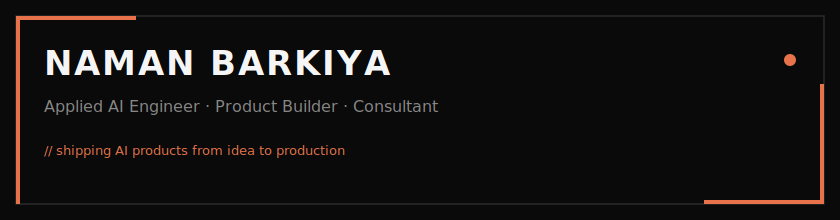

<div align="center">

<!-- BANNER -->


<br/>

<!-- SOCIAL BADGES — brutalist flat style -->
<a href="https://nbarkiya.xyz">
  
</a>&nbsp;&nbsp;
<a href="https://www.linkedin.com/in/namanbarkiya">
  
</a>&nbsp;&nbsp;
<a href="https://twitter.com/namanbarkiya">
  
</a>&nbsp;&nbsp;
<a href="mailto:naman.barkiya02@gmail.com">
  
</a>&nbsp;&nbsp;
<a href="https://www.singlebit.xyz">
  
</a>

</div>

<br/>

<!-- DIVIDER -->


## About

```
┌─────────────────────────────────────────────────────────────────────┐
│                                                                     │
│   Name        Naman Barkiya                                         │
│   Title       Applied AI Engineer & Consultant                      │
│   Company     SingleBit (singlebit.xyz)                             │
│   Location    India                                                 │
│   Focus       Applied AI · Full-Stack · Product Building            │
│                                                                     │
│   Philosophy  "Ship fast. Ship often. Make AI do the boring stuff." │
│                                                                     │
└─────────────────────────────────────────────────────────────────────┘
```

<br/>


## Experience

<table>
  <thead>
    <tr>
      <th width="160">Role</th>
      <th width="160">Company</th>
      <th>What I Did</th>
    </tr>
  </thead>
  <tbody>
    <tr>
      <td><strong>AI Developer & Consultant</strong></td>
      <td><code>Independent</code></td>
      <td>Building AI-powered products and advising startups on applied AI strategy. Helping teams ship MVPs with LLMs, RAG, and agent architectures.</td>
    </tr>
    <tr>
      <td><strong>Software Dev Engineer</strong></td>
      <td><a href="https://www.ubs.com/in/en.html"><code>UBS</code></a></td>
      <td>Shipped production features within the first month for a trader-facing P&L dashboard used by global stakeholders. Financial data systems at scale.</td>
    </tr>
    <tr>
      <td><strong>Founding Engineer</strong></td>
      <td><a href="https://muzecmo.com"><code>Muze AI</code></a></td>
      <td>Improved LLM function-calling accuracy through structured prompt design. Built an AI platform that creates, manages, and optimizes ads on Meta & Google.</td>
    </tr>
    <tr>
      <td><strong>Web Developer</strong></td>
      <td><a href="https://www.builtdesign.in/"><code>Builtdesign</code></a></td>
      <td>Developed client websites using React, Angular, and GraphQL. Full-stack development across multiple projects.</td>
    </tr>
  </tbody>
</table>

<br/>


## What I Build

<table>
  <tr>
    <td width="50%" valign="top">
      <h4>🧠 Applied AI</h4>
      <p>
        &nbsp;
        &nbsp;
        &nbsp;
        &nbsp;
        &nbsp;
        
      </p>
    </td>
    <td width="50%" valign="top">
      <h4>🚀 Product Engineering</h4>
      <p>
        &nbsp;
        &nbsp;
        &nbsp;
        &nbsp;
        &nbsp;
        
      </p>
    </td>
  </tr>
</table>

<br/>


## Tech Stack

<div align="center">

<table>
  <thead>
    <tr>
      <th>Category</th>
      <th>Technologies</th>
    </tr>
  </thead>
  <tbody>
    <tr>
      <td><strong>AI & Data</strong></td>
      <td>
        
        
        
        
      </td>
    </tr>
    <tr>
      <td><strong>Frontend</strong></td>
      <td>
        
        
        
        
        
        
      </td>
    </tr>
    <tr>
      <td><strong>Backend</strong></td>
      <td>
        
        
        
        
      </td>
    </tr>
    <tr>
      <td><strong>Databases</strong></td>
      <td>
        
        
        
        
        
      </td>
    </tr>
    <tr>
      <td><strong>DevOps</strong></td>
      <td>
        
        
        
        
      </td>
    </tr>
  </tbody>
</table>

</div>

<br/>


## Projects

<table>
  <thead>
    <tr>
      <th width="280">Project</th>
      <th>Description</th>
      <th width="80">Stars</th>
    </tr>
  </thead>
  <tbody>
    <tr>
      <td><strong><a href="https://github.com/namanbarkiya/minimal-next-portfolio">minimal-next-portfolio</a></strong></td>
      <td>Open-source Next.js portfolio template — trusted & forked by devs worldwide</td>
      <td>⭐ 150+</td>
    </tr>
    <tr>
      <td><strong><a href="https://github.com/namanbarkiya/niya-saas-template">niya-saas-template</a></strong></td>
      <td>Production-ready SaaS starter for Next.js — auth, Supabase, beautiful UI</td>
      <td>⭐ 35+</td>
    </tr>
    <tr>
      <td><strong><a href="https://github.com/namanbarkiya/niya-fastapi-template">niya-fastapi-template</a></strong></td>
      <td>FastAPI template with Supabase auth, rate limiting & docs — ship backends fast</td>
      <td>⭐ 5+</td>
    </tr>
    <tr>
      <td><strong><a href="https://nbarkiya.xyz/projects/convot">Convot</a></strong></td>
      <td>AI chatbot platform — crawls, indexes, and embeds knowledge for source-grounded answers via a one-line widget</td>
      <td>—</td>
    </tr>
    <tr>
      <td><strong><a href="https://github.com/namanbarkiya/riskread-ai">riskread-ai</a></strong></td>
      <td>AI-powered risk analysis tool</td>
      <td>—</td>
    </tr>
    <tr>
      <td><strong><a href="https://github.com/namanbarkiya/MCP-todo-client-server">MCP-todo-client-server</a></strong></td>
      <td>Model Context Protocol — client + server implementation</td>
      <td>—</td>
    </tr>
  </tbody>
</table>

<br/>


## Open Source

<table>
  <thead>
    <tr>
      <th>Organization</th>
      <th>Contribution</th>
      <th>Impact</th>
    </tr>
  </thead>
  <tbody>
    <tr>
      <td><strong>Microsoft</strong> · Autogen</td>
      <td><a href="https://github.com/microsoft/autogen/pull/1445">Fixed gallery component</a></td>
      <td>Improved community showcase</td>
    </tr>
    <tr>
      <td><strong>Creative Commons</strong></td>
      <td><a href="https://github.com/creativecommons/creativecommons.github.io-source/pull/738">Navbar issue fix</a></td>
      <td>UX improvement</td>
    </tr>
    <tr>
      <td><strong>Creative Commons</strong></td>
      <td><a href="https://github.com/creativecommons/creativecommons.github.io-source/pull/719">Created new section</a></td>
      <td>Content expansion</td>
    </tr>
  </tbody>
</table>

<br/>

<!-- SNAKE -->
<div align="center">
  <picture>
    <source media="(prefers-color-scheme: dark)" srcset="https://raw.githubusercontent.com/namanbarkiya/namanbarkiya/output/github-snake-dark.svg" />
    <source media="(prefers-color-scheme: light)" srcset="https://raw.githubusercontent.com/namanbarkiya/namanbarkiya/output/github-snake.svg" />
    
  </picture>
</div>

<br/>


## Stats

<div align="center">
  
  
</div>

<div align="center">
  
  
</div>

<br/>


<div align="center">

  <a href="https://nbarkiya.xyz/contact">
    
  </a>

<br/><br/>

  <a href="https://buymeachai.ezee.li/namanbarkiya" target="_blank" rel="noopener noreferrer">
    
  </a>

<br/><br/>

  

</div>

<!---
namanbarkiya/namanbarkiya is a ✨ special ✨ repository because its `README.md` (this file) appears on your GitHub profile.
You can click the Preview link to take a look at your changes.
--->
